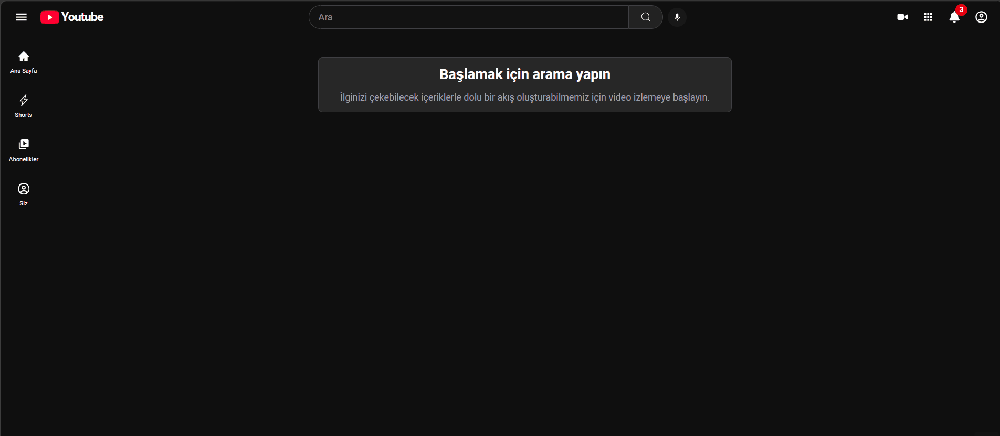

<h1>🎬 YouTube Clone</h1>

A video platform application developed with React and modern frontend technologies, inspired by YouTube's interface and core features. Users can explore trending videos, search for content, filter videos by category, and view video details.

<h2>🚀 Project Overview</h2>

This project was developed to gain practical experience in React development, API integration, and dynamic content management. Video data is fetched from the RapidAPI YouTube API using Axios.

<h2>✨ Features</h2>

<ul>
  <li>Trending videos</li>
  <li>Video search functionality</li>
  <li>Category-based filtering</li>
  <li>Video details and playback</li>
  <li>YouTube Shorts</li>
  <li>Responsive user interface</li>
</ul>

<h2>🛠️ Technologies Used</h2>

<ul>
  <li>React</li>
  <li>Vite</li>
  <li>Tailwind CSS</li>
  <li>React Router DOM</li>
  <li>Axios</li>
  <li>React Player</li>
  <li>React Icons</li>
  <li>Millify</li>
  <li>RapidAPI YouTube API</li>
</ul>

<h2>🎯 Learning Outcomes</h2>

This project helped me practice building reusable React components, fetching data from external APIs, managing asynchronous requests, implementing client-side routing, and developing interactive user interfaces.

<h2>👀 Preview</h2>

